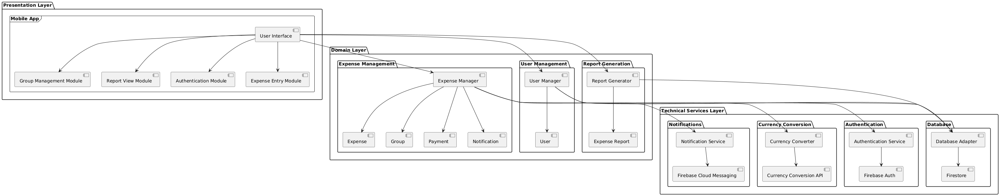
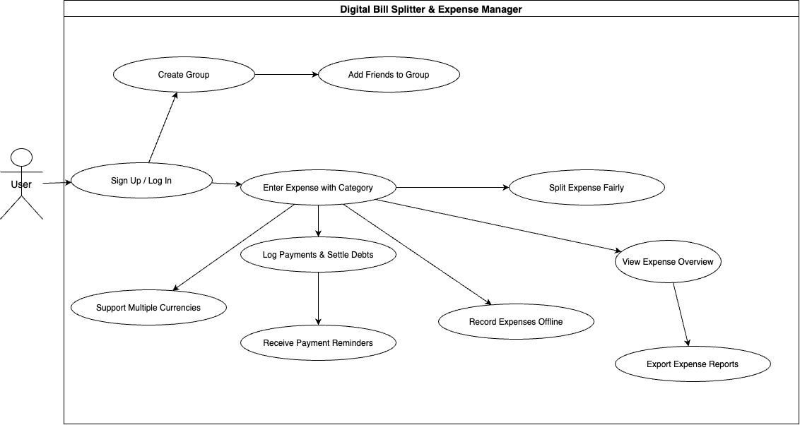

# PROJECT Design Documentation

## Team Information
* Team name: MSN
* Team members
  * Sai Sandeep Ramavath
  * Mallikarjuna Tupakula
  * Nithikesh Reddy Bobilli
  * MEMBER4

## Executive Summary

However, tracking shared expenses can be a challenge, especially when it comes to friends, roommates, and traveling. Uncertainty often Causes confusion and possible disputes about the precise financial obligations of each party. and any arrangements for the settlement. In an effort to assist with the reconciliation process, the Digital Bill Splitter & Expense Manager provides a Simple and efficient way to keep track of any mixed expenses.

The app allows users to create groups, add friends, note the expense diary with types, and analyze cost-sharing dynamics. It supports different currencies, tracks debts in real-time, and sends payment reminders. It allows expenditures to be recorded offline, creating reports for later export, and sharing. Built on Expo React-Native and using Firebase for backend services, it guarantees speed, cross-platform operability, and real-time synchronization. In short, the app unleashes the burden of settling shared spending among friends, Ensuring transparency and ease of use.

## Requirements

This section describes the features of the application.

### Definition of MVP
The Minimum Viable Product is the very first working version of an application with just the essential features to figure out whether it has any purpose. Creating such a product aims to accomplish what you need with the least work possible and still provide real value to users. The MVP will form the basis for any further improvements and iterations dependent on feedback from users and business goals.

### MVP Features

- **User Registration**
  - Users will be able to create their own account by providing a valid username, email, and password. The system will validate inputs and notify users of any errors.

- **User Login**
  - Users will be able to access the platform only if they have a valid account.

- **Manage Profile**
  - Users will be able to update, delete, and manage their profiles and they can verify their account.

- **Group Expense Management**
  - Users will be able to create and manage groups to track shared expenses efficiently.

- **Adding and Categorizing Expenses**
  - Users can add expenses, assign categories, and maintain structured records for better financial tracking.

- **Splitting Expenses Fairly**
  - Users can split expenses equally or in custom proportions among group members.

- **Debt Payment Tracking and Reminders**
  - Users can log payments, track due amounts, and receive notifications for pending settlements.

- **Expense Summary and Reports**
  - Users can generate expense summaries and reports for better financial insights.

- **Push Notifications**
  - Users will receive notifications for expense updates and payment reminders.

- **Multi-Currency Support**
  - The application will support multiple currencies to facilitate international transactions.

- **Export and Sharing of Reports**
  - Users can export and share their expense reports with other group members.

- **Offline Mode for Expense Entry**
  - Users will be able to enter expenses offline, and the data will sync when they go online.

#### User Stories
- **User Registration and Authentication**
  - As a user, I would like to sign up or log in, so that I can access my expense records securely.
  - As a user, I would like to manage my profile, so that I can update or delete my information when needed.

- **Group Expense Management**
  - As a user, I would like to create a group and add friends, so that we can track shared expenses.
  - As a user, I would like to manage my group, so that I can add or remove members easily.

- **Addition and Categorization of Expenses**
  - As a user, I would like to enter expenses with categories, so that I can keep my expenditures organized.

- **Splitting Expenses Fairly**
  - As a user, I'd like to split an expense fifty-fifty or in any ratio, so that we can divide costs efficiently.

- **Debt Payment Tracking and Reminders**
  - As a user, I'd like to log payments and indicate debts paid, so that I can track who has settled their balance.
  - As a user, I'd like to receive notifications for outstanding debts, so that I don’t forget payments.

- **Expense Summary and Reports**
  - As a user, I'd like to see an expense overview, so that I can monitor my spending.
  - As a user, I'd like to export expense reports, so that I can share them with my group members.

- **Support for Multiple Currencies**
  - As a user, I'd like to use multiple currencies, so that I can split expenses across different countries.

- **Offline Mode for Expense Entry**
  - As a user, I'd like to record expenses offline, so that I can manage my expenses without internet access.

## Architecture and Design

This section describes the application architecture.

### Software Architecture

The application follows a layered architecture comprising three main layers:

**Presentation Layer:** The front-end of the application, built with Expo React Native, which includes modules for group management, report views, authentication, and expense entry.

**Domain Layer:** This layer includes the core business logic, such as expense management (handling expenses, groups, payments, and notifications), user management, and report generation.

**Technical Services Layer:** This layer integrates Firebase services, including:
- **Notifications:** Firebase Cloud Messaging for push notifications.
- **Currency Conversion:** A currency converter API to handle multi-currency transactions.
- **Authentication:** Firebase Authentication for user sign-in and security.
- **Database:** Firestore as the primary real-time database for storing expenses, groups, and payments.

The architecture ensures a modular and scalable approach, making it easier to maintain and expand functionalities in the future.

**Technology Stack:**
- **Frontend:** Expo React Native
- **Backend:** Firebase Functions (Node.js/Python)
- **Database:** Firebase Firestore
- **Authentication:** Firebase Authentication
- **Push Notifications:** Firebase Cloud Messaging (FCM)
- **Storage:** Firebase Storage (for receipt uploads, if required)

### Use Case Diagram

The use case diagram illustrates the interaction between the user and the system. It includes functionalities such as:

- **User Registration and Login**
- **Creating Groups and Adding Friends**
- **Entering and Categorizing Expenses**
- **Splitting Expenses Among Group Members**
- **Logging Payments and Settling Debts**
- **Viewing Expense Overviews and Exporting Reports**
- **Supporting Multiple Currencies**
- **Recording Expenses Offline**

